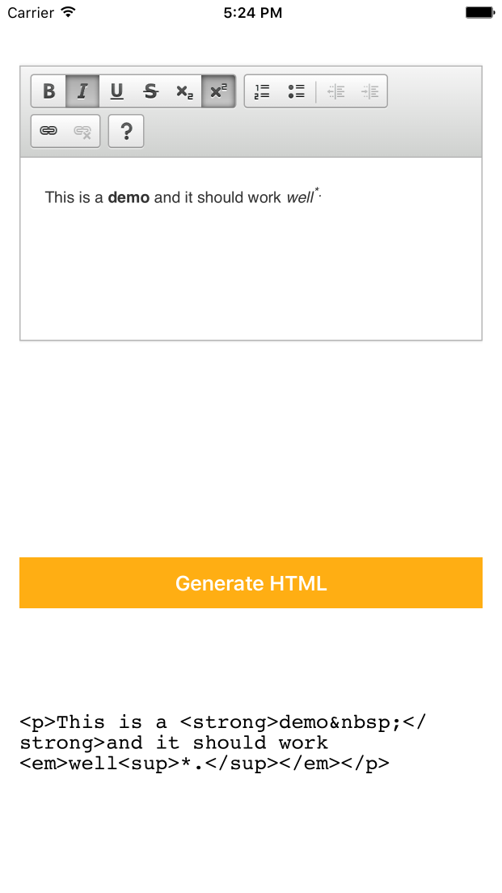

# iOS-HTMLTextEditor

A simple implementation of an HTML Editor using CKEditor in a web view.

The configuration of the editor can be altered in the HTML file. (Visit <http://ckeditor.com/> for further details about the HTML editor - there are additional styles available)

Following files need to be configured:

- `CKEditor/config.js` - For handling toolbar and UI components of the editor.
- `CKEditor/contents.css` - Configure the font and the theme for the control.
- `CKEditor/setup-script.js` - To load the editor into the HTML.
- `Skins` - Put additional skins and plugins in place according to your needs.

